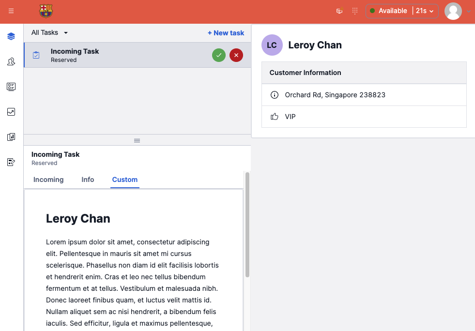
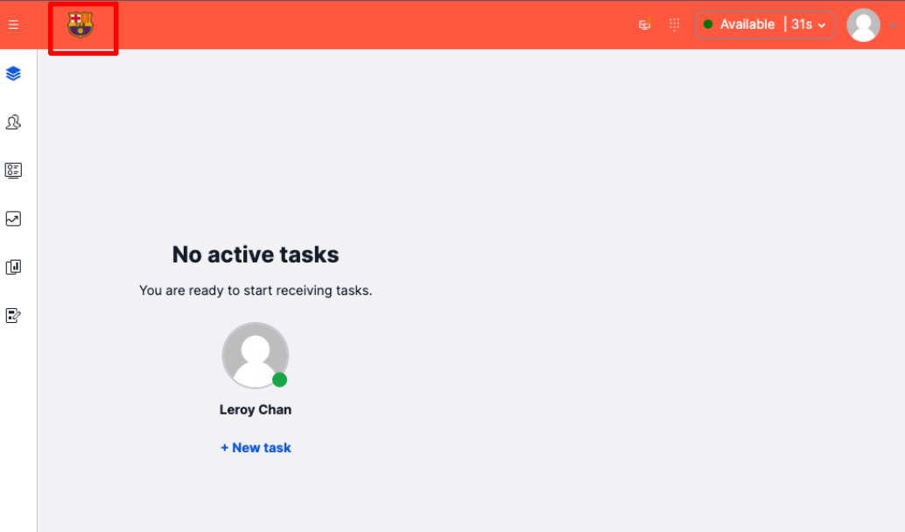
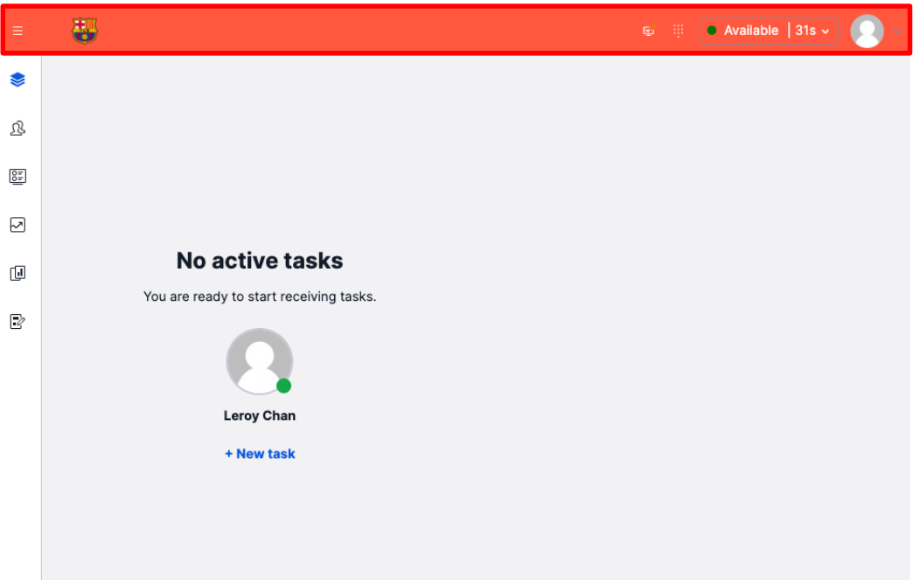
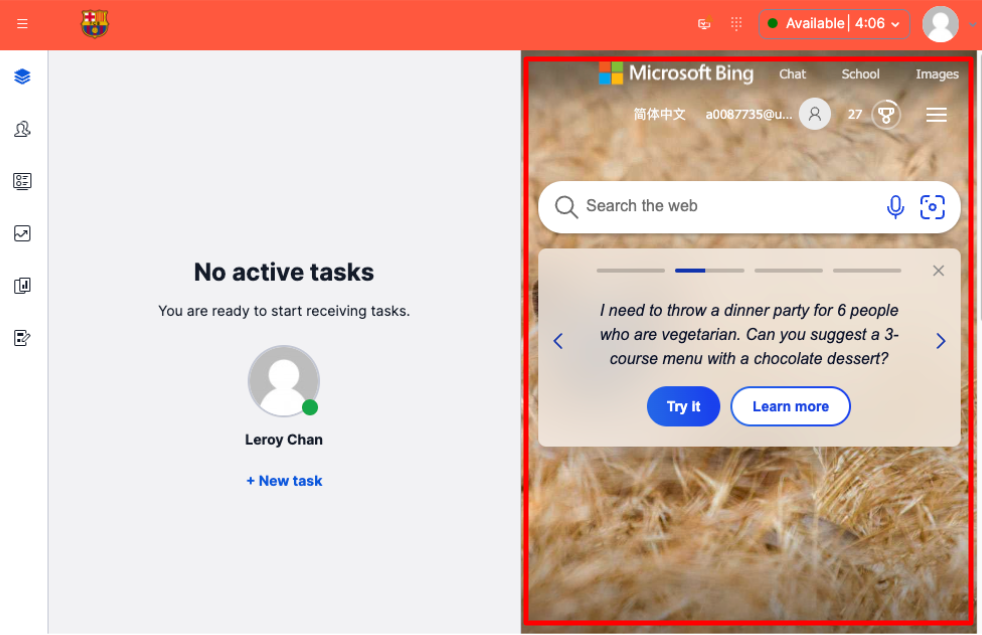
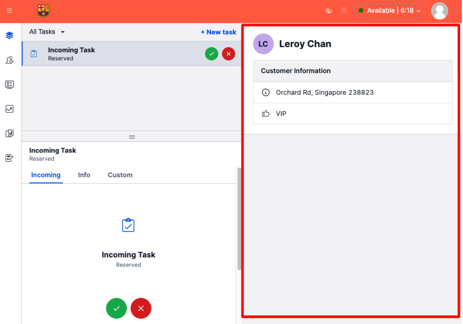
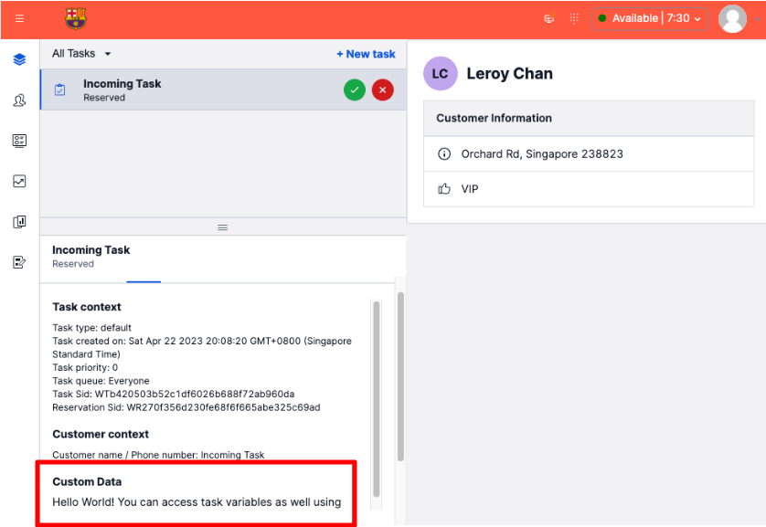
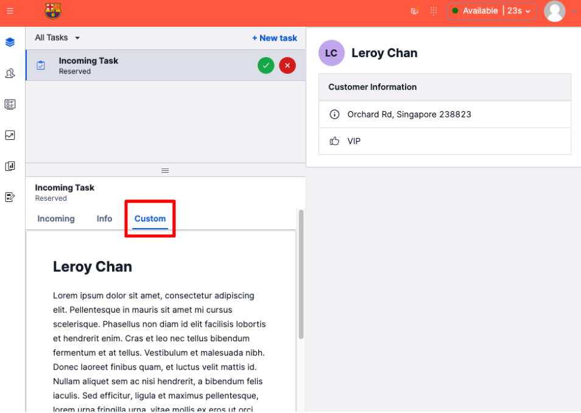
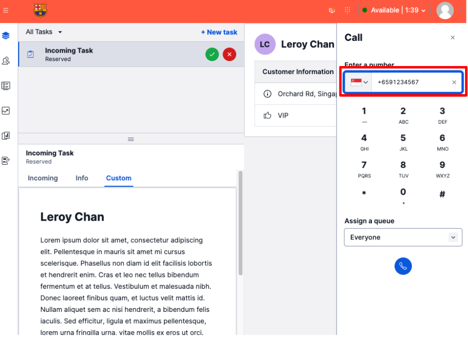

# Flex UI 2.x Sample Code Snippets

This GitHub repository contains common code snippets for customizing Twilio Flex, a programmable contact center platform. These code snippets can be used as a starting point for implementing various customizations in your Twilio Flex application.

_Note: All sample use cases are based on Flex UI 2.x_



## Table of Content

1. [Pre-Requisites](#pre-requisites)
2. [Generating Flex Plugin Boilerpalte](#generating-flex-plugin-boilerplate)
3. [Use Case 1: Use Twilio Paste](#use-case-1-use-twilio-paste)
4. [Use Case 2: Modify Logo](#use-case-2-modify-logo)
5. [Use Case 3: Customize Color Scheme](#use-case-3-customize-color-scheme)
6. [Use Case 4: iFrame CRM in Flex](#use-case-4-iframe-crm-in-flex)
7. [Use Case 5: Custom CRM in Flex](#use-case-5-custom-crm-in-flex)
8. [Use Case 6: Add Custom Data into Default Task Info Panel](#use-case-6-add-custom-data-into-default-task-info-panel)
9. [Use Case 7: Add Custom Tab](#use-case-7-add-custom-tab)
10. [Use Case 8: Forced SIP Call via Flex Native Dialpad](#use-case-8-forced-sip-call-via-flex-native-dialpad)

# Pre-Requisites

1. Twilio Flex Account ([Guide](https://support.twilio.com/hc/en-us/articles/360020442333-Setup-a-Twilio-Flex-Account)) with Flex UI 2.x
2. Node.js v16.x.x ([Guide](https://docs.npmjs.com/downloading-and-installing-node-js-and-npm))
3. Twilio CLI v5.4.2 or above ([Guide](https://www.twilio.com/docs/twilio-cli/quickstart))
4. Twilio CLI Flex Plugin v6.0.4 or above ([Guide](https://www.twilio.com/docs/flex/developer/plugins/cli))
5. Twilio CLI Serverless Plugin v3.1.3 or above ([Guide](https://www.twilio.com/docs/labs/serverless-toolkit/getting-started))

# Generating Flex Plugin Boilerplate

1. On your terminal, `twilio flex:plugins:create <<FLEX_PLUGIN_NAME>> --install --flexui2`
2. `cd <<FLEX_PLUGIn_NAME>>`
3. To start local development, `twilio flex:plugins:start`
4. Once ready to deploy, ensure that `twilio profiles:list` has an active Flex account set.
5. `twilio flex:plugins:deploy --changelog "Initial Deployment"`
6. `twilio flex:plugins:release --plugin PLUGIn_NAME_HERE@0.0.1 --name "PLUGIN NAME HERE" --description "DESCRIPTION HERE"`

# Use Case 1: Use Twilio Paste

[Twilio Paste](https://paste.twilio.design/) is a UI Framework used to build accessible, cohesive, and high-quality customer experiences at Twilio.

```
import { CustomizationProvider } from "@twilio-paste/core/customization";

flex.setProviders({
      PasteThemeProvider: CustomizationProvider,
    });
```

# Use Case 2: Modify Logo



```
flex.MainHeader.defaultProps.logoUrl =
      "https://idreamleaguesoccerkits.com/wp-content/uploads/2017/12/barcelona-logo.png";
```

# Use Case 3: Customize Color Scheme



Under `public/appConfig.js`, add the following:

```
theme: {
    tokens: {
      backgroundColors: {
        colorBackgroundPrimaryStrongest: "tomato",
      },
    },
  },
```

# Use Case 4: iFrame CRM in Flex



```
flex.CRMContainer.defaultProps.uriCallback = (task) => {
    return task
        ? `https://www.bing.com/search?q=${task.attributes.name}`
        : "https://www.bing.com";
};
```

# Use Case 5: Custom CRM in Flex



Create a new React component (Example is in `/src/components/CRM.js`)

```
import CRM from "./components/CRM";

flex.AgentDesktopView.Panel2.Content.replace(<CRM key="test" />, {
    sortOrder: -1,
});
```

# Use Case 6: Add custom data into default Task Info Panel



```
manager.strings.TaskInfoPanelContent += `\n<p>Custom Data</p>Hello World! You can access task variables as well using placeholders. Example of Task Name: {{task.attributes.name}}`;
```

# Use Case 7: Add custom tab



Create a new React component (Example is in `/src/components/CustomTab.js`)

```
import { Tab } from "@twilio/flex-ui";

flex.TaskCanvasTabs.Content.add(
    <Tab label="Custom" key="custom-tab-key">
        <CustomTab key="custom-tab" />
    </Tab>
);
```

# Use Case 8: Forced SIP Call via Flex Native Dialpad



```
 // -- Start Optional: Mask SIP Dialstring from Task within Flex Agent Interface
flex.Manager.getInstance().strings.TaskLineOutboundCallHeader =
  "{{task.attributes.name}}";
// -- End Optional: Mask SIP Dialstring from Task within Flex Agent Interface
flex.Actions.replaceAction("StartOutboundCall", (payload, original) => {
  // -- Start Optional: Mask SIP Dialstring from Task within Flex Agent Interface
  const originalNumber = payload.destination;
  payload.taskAttributes = {
    name: originalNumber,
  };
  // -- End Optional: Mask SIP Dialstring from Task within Flex Agent Interface
  // Default all outbound calls to external SIP interface
  /*
    * Instructions:
    * Replace "sipInterfaceIPAddress" with external SIP Interface
    */
  const sipInterfaceIPAddress = "xxx.xxx.xxxx.xxx";
  payload.destination =
    "sip:" + payload.destination + `@${sipInterfaceIPAddress}`;
  payload.callerId = "+xxxxxxxx";
  console.log("updated outbound call to:", payload);
  original(payload);
});
```
